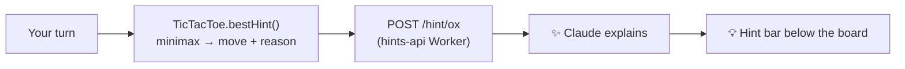

# ⭕ OX — Tic Tac Toe

A clean, responsive **Tic Tac Toe** built from scratch with **TypeScript + Vite** — play a friend or
a CPU whose strength you choose, with an optional **AI hint** that explains the best move in plain
English.

**▶️ Play:** **https://game-ox.sahilparekh1212.com** &nbsp;·&nbsp; 🕹️ [All games](https://games.sahilparekh1212.com)

## 📑 Contents

- [✨ Features](#-features)
- [🚀 Run locally](#-run-locally)
- [🎯 How to play](#-how-to-play)
- [🧠 How the AI hint works](#-how-the-ai-hint-works)
- [🏗️ Design & project structure](#️-design--project-structure)
- [🧪 Testing & verification](#-testing--verification)
- [🚀 Deployment](#-deployment)
- [📄 License](#-license)

## ✨ Features

- 🤖 **vs CPU** with three engine strengths, or 👥 **2 players** on one device (with custom names).
- 🪙 **Coin-flip start** (or pick who opens), animated.
- 💡 **AI hint** — an optional, draggable bar under the board that explains the recommended move,
  refreshed every turn. Toggle it on/off; it never covers the board.
- 📱 Fully responsive — the board scales to the viewport and squares are tap-friendly.
- ♟️ A real **minimax** engine (no library).

## 🚀 Run locally

```bash
git clone https://github.com/sahilparekh1212/Game_OX
cd Game_OX
npm install       # first time only
npm run dev       # → http://localhost:5173
```

Other scripts:

```bash
npm run build     # type-check (tsc, strict) + Vite production build → dist/
npm run preview   # serve the production build locally
```

The AI hint needs the [`hints-api`](https://github.com/sahilparekh1212/games#-the-ai-backend--endpoints)
backend. To point local dev at a Worker, run in the browser console:
`localStorage.setItem("hintsApi", "http://localhost:8787")`.

## 🎯 How to play

- **Mode** — *vs CPU* or *2 Players*. In 2-player, enter names and the scoreboard uses them.
- **Difficulty** (vs CPU):
  - 🟢 **Easy** — random moves.
  - 🟡 **Medium** — takes a win, blocks yours, else random.
  - 🔴 **Hard** — **minimax** with an occasional deliberate slip: always takes an open win, rarely
    errs, but a sharp opponent can still catch it — *strong, not unbeatable*.
- **Play as** X or O · **First move** — You, CPU, or 🪙 Flip.
- Line up three to win; fill the board with no line for a draw. A round-end popup offers **New Game**
  (keeps scores) or **Reset Score**.

## 🧠 How the AI hint works

The hint follows one rule used across all my games:

> **The engine finds the move. Claude only explains it.**

1. On your turn, [`TicTacToe.bestHint()`](src/game.ts) runs the **same minimax** the CPU uses and
   returns `{ index, reason }`, where `reason` is `win` / `block` / `center` / `opening` / `best`.
2. The browser POSTs the board + that recommendation to the **`hints-api`** Worker
   (see [`src/hints.ts`](src/hints.ts)).
3. The Worker asks **Claude** to phrase a 2–3 sentence coaching tip and returns just the text.



Why this design? The move is **always correct** (it's from verified game code), the LLM call is
**tiny and cheap**, and the **API key never touches the browser** — the game only ever calls the
Worker. Results are cached per position and the bar updates itself each move.

**Endpoint contract** — `POST /hint/ox`:

```jsonc
// request
{ "board": ["X","X",null,"O","O",null,null,null,null], "toMove": "X", "recommended": 2, "reason": "win" }
// response
{ "hint": "Play the top-right corner to complete your top row and win." }
```

## 🏗️ Design & project structure

The codebase separates **game logic** from **DOM/rendering** — the engine is pure and testable, the
UI layer just reflects state.

```
Game_OX/
├── index.html                      # page shell + all styling
├── src/
│   ├── game.ts                     # TicTacToe class: rules, scoring, AI (minimax) + bestHint()
│   ├── main.ts                     # DOM wiring, rendering, hint bar, dropdown controls
│   └── hints.ts                    # thin client for the hints-api Worker
├── .github/workflows/deploy.yml    # CI: build + publish to GitHub Pages
├── package.json · tsconfig.json
└── LICENSE
```

- 🧠 [`src/game.ts`](src/game.ts) — the `TicTacToe` engine: move legality, win/draw detection,
  three CPU difficulties, and `bestHint()` (minimax from the human's perspective).
- 🎨 [`src/main.ts`](src/main.ts) — builds the grid, renders state, drives the dropdown controls and
  the draggable hint bar.
- 🔌 [`src/hints.ts`](src/hints.ts) — one `fetch` wrapper around the Worker endpoint.
- 🚢 [`.github/workflows/deploy.yml`](.github/workflows/deploy.yml) — the deploy pipeline.

## 🧪 Testing & verification

- ✅ **Type safety + build** — `npm run build` runs `tsc` in **strict** mode then a Vite build. This
  is the CI gate; a red build blocks deploy.
- 🕹️ **Logic checks** — the engine is exercised through the running app: e.g. `bestHint()` is
  asserted to return the *winning* square when one exists, the *blocking* square when the opponent
  threatens, and `null` when it isn't your turn.
- 🔌 **Hint flow** — the endpoint round-trip is verified against a local mock (loading → tip → cache),
  and the live Worker is contract-tested with `curl` (allowed vs. disallowed origin, bad body, etc.).

## 🚀 Deployment

Pushing to `main` triggers [`.github/workflows/deploy.yml`](.github/workflows/deploy.yml), which
type-checks, builds with Vite, and publishes `dist/` to **GitHub Pages**. The custom domain
`game-ox.sahilparekh1212.com` is a DNS `CNAME` → `sahilparekh1212.github.io`.

## 📄 License

Released under the [MIT License](LICENSE).
